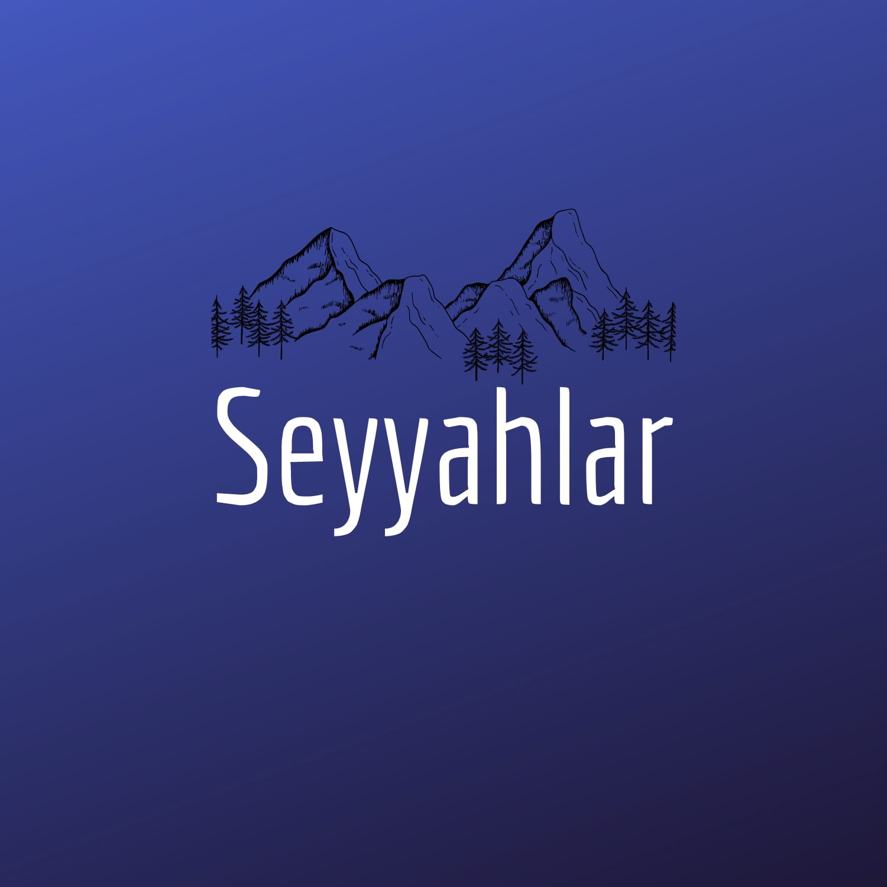

<a name="readme-top"></a>

[![Contributors][contributors-shield]][contributors-url]
[![Forks][forks-shield]][forks-url]
[![Stargazers][stars-shield]][stars-url]
[![Issues][issues-shield]][issues-url]
[![MIT License][license-shield]][license-url]
[![LinkedIn][linkedin-shield]][linkedin-url]


<!-- PROJECT LOGO -->
<br />
<div align="center">
  <a href="https://github.com/mustafapeksen/seyyahlar-news">
    
  </a>

  <h3 align="center">seyyahlar-news</h3>

  <p align="center">
    An awesome README template to jumpstart your projects!
    <br />
    <a href="https://github.com/mustafapeksen/seyyahlar-news"><strong>Explore the docs »</strong></a>
    <br />
    <br />
     <a href="https://github.com/mustafapeksen/seyyahlar-news">View Demo</a>
    ·
    <a href="https://github.com/mustafapeksen/seyyahlar-news/issues/new?labels=bug&template=bug-report---.md">Report Bug</a>
    ·
    <a href="https://github.com/mustafapeksen/seyyahlar-news/issues/new?labels=enhancement&template=feature-request---.md">Request Feature</a>
  </p>
</div>


<!-- TABLE OF CONTENTS -->
<details>
  <summary>Table of Contents</summary>
  <ol>
    <li>
      <a href="#about-the-project">About The Project</a>
      <ul>
        <li><a href="#built-with">Built With</a></li>
      </ul>
    </li>
    <li>
      <a href="#getting-started">Getting Started</a>
      <ul>
        <li><a href="#prerequisites">Prerequisites</a></li>
        <li><a href="#installation">Installation</a></li>
      </ul>
    </li>
    <li><a href="#usage">Usage</a></li>
    <li><a href="#contributing">Contributing</a></li>
    <li><a href="#license">License</a></li>
    <li><a href="#contact">Contact</a></li>
  </ol>
</details>


<!-- ABOUT THE PROJECT -->
## About The Project

This project is a web application called "Seyyahlar Haber" that provides users with news articles from various categories such as general, entertainment, health, economy, technology, and world news. Users can navigate through different categories, view news articles, and paginate through multiple pages of articles.

The application fetches data from an external API and displays it dynamically using React.js. It also utilizes Material-UI icons for pagination buttons and provides a loading animation while fetching data.

## Features

- Display news articles from various categories
- Navigate through different categories
- Paginate through multiple pages of articles
- View detailed information about each news article
- Loading animation while fetching data

<p align="right">(<a href="#readme-top">back to top</a>)</p>


### Built With

All main frameworks/libraries used in the project are listed.

* [![React][React.js]][React-url]
* [](https://developer.mozilla.org/en-US/docs/Web/JavaScript)
* [](https://developer.mozilla.org/en-US/docs/Web/HTML)
* [](https://developer.mozilla.org/en-US/docs/Web/CSS)
* [](https://github.com/axios/axios)


<p align="right">(<a href="#readme-top">back to top</a>)</p>


<!-- GETTING STARTED -->
## Installation

_Below is an example of how you can instruct your audience on installing and setting up your app. This template doesn't rely on any external dependencies or services._

1. Get a free API Key at [https://collectapi.com/api/news/news-api](https://collectapi.com/api/news/news-api)
2. Clone the repo
   ```sh
   git clone https://github.com/mustafapeksen/seyyahlar-news.git
   ```
3. Install NPM packages
   ```sh
   npm install
   ```
4. Enter your API in `App.jsx`
   ```jsx
   const yourApiKey = 'ENTER YOUR API';
   const countryCode = 'ENTER YOUR COUNTRY CODE'
   ```

<p align="right">(<a href="#readme-top">back to top</a>)</p>


<!-- USAGE EXAMPLES -->
## Usage

After all the installations are completed, type `npm run dev` in the terminal. Go to `localhost:5173` from the browser.
```bash
npm run dev
```

<p align="right">(<a href="#readme-top">back to top</a>)</p>


<!-- CONTRIBUTING -->
## Contributing

Thank you for considering contributing to this project! To make the contribution process smooth for everyone who wants to contribute, it's important to follow the steps outlined below.

### How to Contribute

1. Fork this repository.
2. Create a new branch: `git checkout -b feature/new-feature`
3. Make your changes and commit them: `git commit -am 'Added a new feature'`
4. Push your changes to your fork: `git push origin feature/new-feature`
5. Open a Pull Request.

### Things to Keep in Mind When Opening a Pull Request

- Your pull request should have a descriptive title and a detailed description.
- Add a clear explanation of what changes you made.
- Make sure you've tested your changes.
- Ensure that your changes are compatible with the existing codebase.

### Help

If you encounter any issues with the contribution process or need help with anything else, please don't hesitate to reach out to us.

<!-- LICENSE -->
## License

Distributed under the MIT License. See [LICENSE](LICENSE) for more information.

<p align="right">(<a href="#readme-top">back to top</a>)</p>


<!-- CONTACT -->
## Contact

Mustafa Pekşen - [@mustafapeksennn](https://twitter.com/mustafapeksennn) - mustafapeksen04@gmail.com

Project Link: [https://github.com/mustafapeksen/seyyahlar-news](https://github.com/mustafapeksen/seyyahlar-news)

<p align="right">(<a href="#readme-top">back to top</a>)</p>


<!-- MARKDOWN LINKS & IMAGES -->
<!-- https://www.markdownguide.org/basic-syntax/#reference-style-links -->
[contributors-shield]: https://img.shields.io/github/contributors/mustafapeksen/seyyahlar-news.svg?style=for-the-badge
[contributors-url]: https://github.com/mustafapeksen/seyyahlar-news/graphs/contributors
[forks-shield]: https://img.shields.io/github/forks/mustafapeksen/seyyahlar-news.svg?style=for-the-badge
[forks-url]: https://github.com/mustafapeksen/seyyahlar-news/network/members
[stars-shield]: https://img.shields.io/github/stars/mustafapeksen/seyyahlar-news.svg?style=for-the-badge
[stars-url]: https://github.com/mustafapeksen/seyyahlar-news/stargazers
[issues-shield]: https://img.shields.io/github/issues/mustafapeksen/seyyahlar-news.svg?style=for-the-badge
[issues-url]: https://github.com/mustafapeksen/seyyahlar-news/issues
[license-shield]: https://img.shields.io/github/license/mustafapeksen/seyyahlar-news.svg?style=for-the-badge
[license-url]: https://github.com/mustafapeksen/seyyahlar-news/LICENSE
[linkedin-shield]: https://img.shields.io/badge/-LinkedIn-black.svg?style=for-the-badge&logo=linkedin&color

[linkedin-url]: https://linkedin.com/in/mustafapeksen04
[product-screenshot]: images/screenshot.png
[React.js]: https://img.shields.io/badge/React-20232A?style=for-the-badge&logo=react&logoColor=61DAFB
[React-url]: https://reactjs.org/
